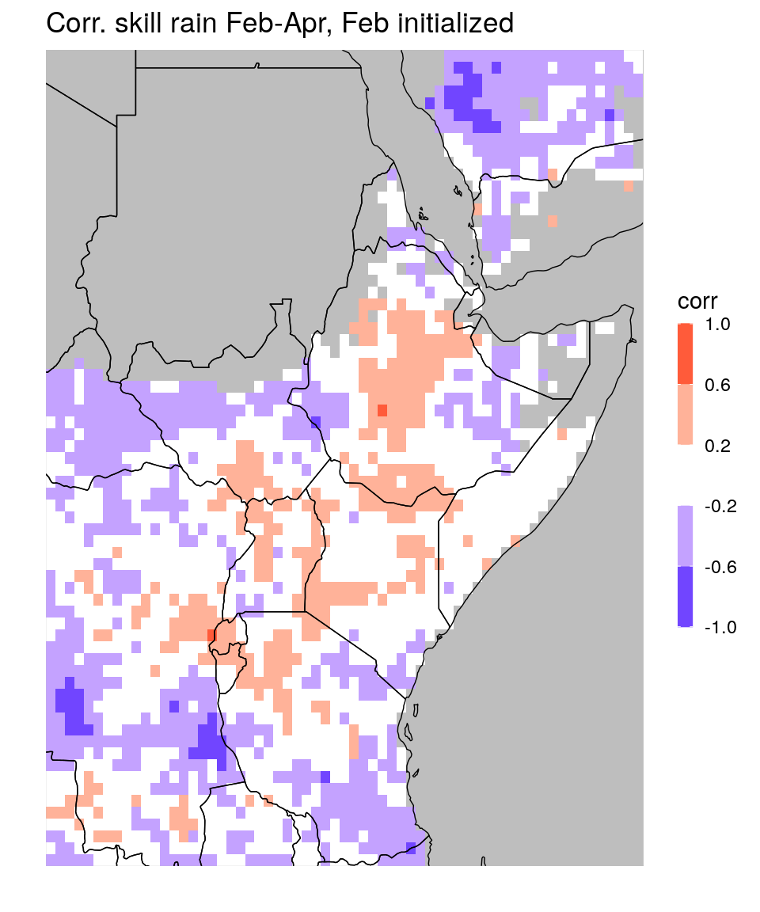
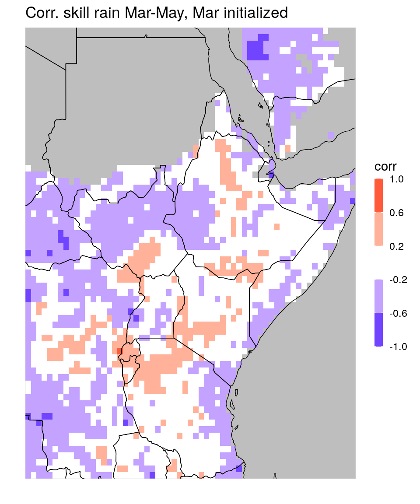
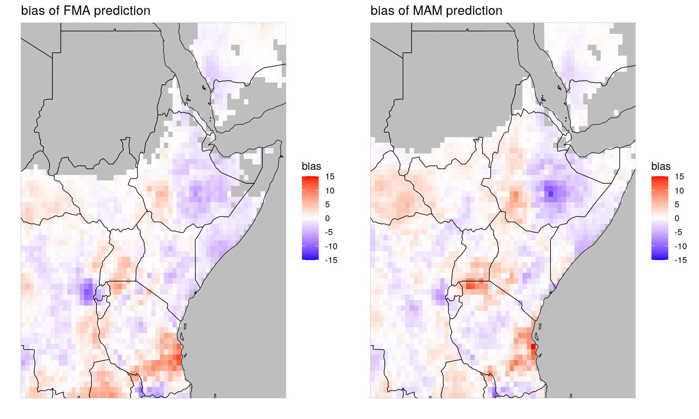
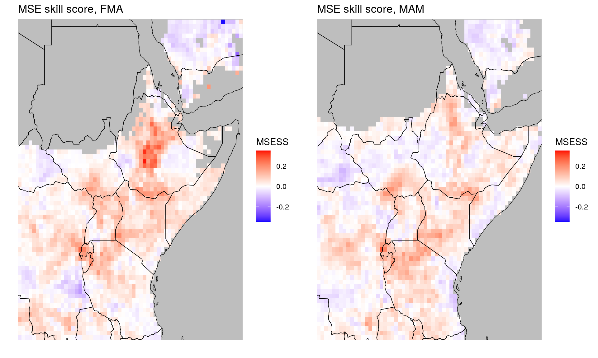
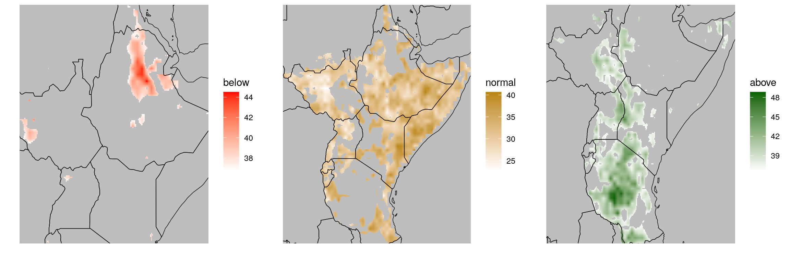
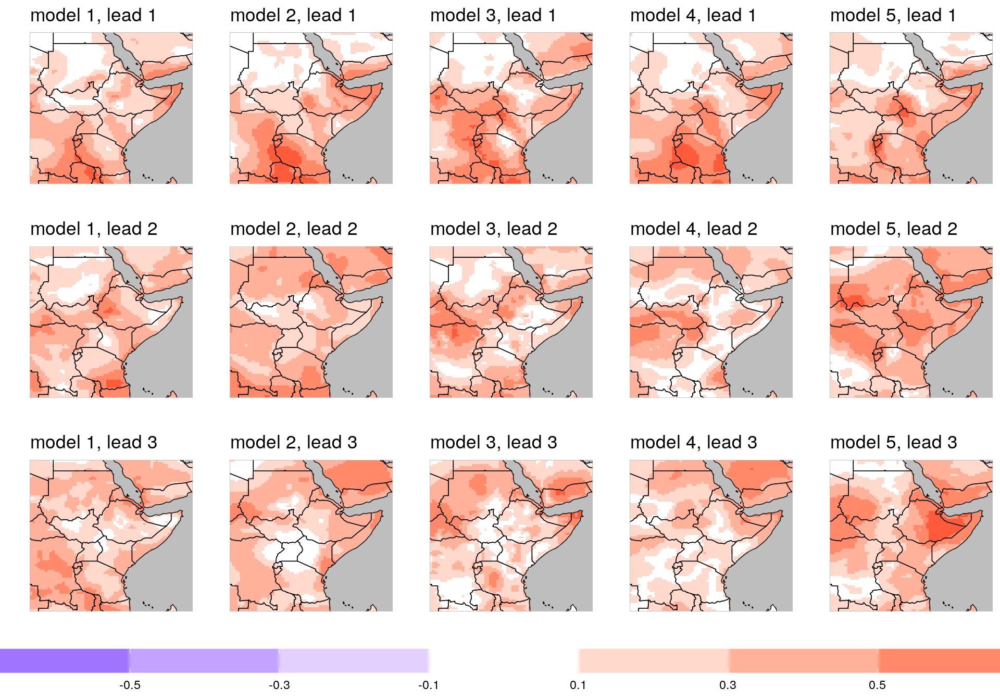

# Evaluation Examples


## Data import with `netcdf_to_dt`

We now provide some hands on examples for data import, data analysis and evaluation using the `SeaVal` package.
The setup is as follows:


```r
library(ggpubr) # allows slightly fancier plots, see below

data_dir = '/nr/project/stat/CONFER/Data/validation/example_data/202102/' # the directory the data is stored in
```

The key function for importing netcdf files is `netcdf_to_dt`, which just takes the name of the netcdf (including directory path):


```r
fn = "CorrelationSkillRain_Feb-Apr_Feb2021.nc"
dt = netcdf_to_dt(paste0(data_dir,fn))
```

```
## File /nr/project/stat/CONFER/Data/validation/example_data/202102/CorrelationSkillRain_Feb-Apr_Feb2021.nc (NC_FORMAT_CLASSIC):
## 
##      1 variables (excluding dimension variables):
##         float corr[lon,lat]   
##             lead: 0
##             average_op_ncl: dim_avg_n over dimension(s): model
##             type: 0
##             time: 13
##             _FillValue: -9999
## 
##      3 dimensions:
##         time  Size:0   *** is unlimited ***
## [1] "vobjtovarid4: **** WARNING **** I was asked to get a varid for dimension named time BUT this dimension HAS NO DIMVAR! Code will probably fail at this point"
##         lat  Size:77
##             units: degrees_north
##         lon  Size:66
##             units: degrees_east
## 
##     6 global attributes:
##         units: mm
##         MonInit_month: 2
##         valid_time: Feb-Apr
##         creation_date: Mon Feb 15 06:59:57 EAT 2021
##         Conventions: None
##         title:  Correlation between Cross-Validated and Observed Rainfall
```

By default, the function prints out all the information it gets from the netcdf, which is often useful. This can be turned off by the `verbose` argument of the function, see `?netcdf_to_dt`.
As we can see, the netcdf consists of a single variable (and the two dimension variables lon and lat). The resulting data table looks like this:


```r
print(dt)
```

```
##        lon   lat corr
##    1: 20.5 -13.5   NA
##    2: 21.0 -13.5   NA
##    3: 21.5 -13.5   NA
##    4: 22.0 -13.5   NA
##    5: 22.5 -13.5   NA
##   ---                
## 5078: 51.0  24.5   NA
## 5079: 51.5  24.5   NA
## 5080: 52.0  24.5   NA
## 5081: 52.5  24.5   NA
## 5082: 53.0  24.5   NA
```

```r
ggplot_dt(dt,
          mn = 'Corr. skill rain Feb-Apr, Feb initialized', # title
          rr = c(-1,1), # range of the colorbar
          discrete_cs = TRUE,binwidth = 0.4, # discretize colorbar
          guide = guide_colorbar(barwidth = 0.5, barheight = 10)) # make colorbar longer
```



We can compare to the March initialized forecast:


```r
fn = "CorrelationSkillRain_Mar-May_Feb2021.nc"

dt = netcdf_to_dt(paste0(data_dir,fn),verbose = 0) 

ggplot_dt(dt,
          mn = 'Corr. skill rain Mar-May, Mar initialized', # title
          rr = c(-1,1), # range of the colorbar
          discrete_cs = TRUE,binwidth = 0.4, # discretize colorbar
          guide = guide_colorbar(barwidth = 0.5, barheight = 10)) # make colorbar longer
```



Next, let us look at a more elaborate example of crossvalidation. In our example folder we have two crossvalidation datasets and corresponding observations (one for FMA, one for MAM). 
We will process them simultaneously here, to highlight more `data.table` syntax.


```r
##### CrossValidatedPredictedRain_Feb-Apr_Feb2021.nc #####

fn_pred1 = "CrossValidatedPredictedRain_Feb-Apr_Feb2021.nc"
fn_pred2 = "CrossValidatedPredictedRain_Mar-May_Feb2021.nc"

dt_pred1 = netcdf_to_dt(paste0(data_dir,fn_pred1),verbose = 0) # they look the same, we can just look at the information from one of them...
dt_pred2 = netcdf_to_dt(paste0(data_dir,fn_pred2))
```

```
## File /nr/project/stat/CONFER/Data/validation/example_data/202102/CrossValidatedPredictedRain_Mar-May_Feb2021.nc (NC_FORMAT_CLASSIC):
## 
##      1 variables (excluding dimension variables):
##         float prec[lon,lat,time]   
##             lead: 1
##             average_op_ncl: dim_avg_n over dimension(s): model
##             type: 1
##             _FillValue: -9999
## 
##      3 dimensions:
##         time  Size:35   *** is unlimited ***
##             units: months since 1981-01-01 
##             calendar: standard
##             _FillValue: 9.96920996838687e+36
##         lat  Size:77
##             units: degrees_north
##         lon  Size:66
##             units: degrees_east
## 
##     6 global attributes:
##         units: mm
##         MonInit_month: 2
##         valid_time: Mar-May
##         creation_date: Mon Feb 15 06:59:57 EAT 2021
##         Conventions: None
##         title:  Cross Validated Predicted Rainfall Total (mm)
```

```r
# add a column, identifying which is which:
dt_pred1[,season:= 'FMA']
dt_pred2[,season:= 'MAM']

# bind together
dt_pred = rbindlist(list(dt_pred1,dt_pred2))
print(dt_pred)
```

```
##          lon   lat time prec season
##      1: 20.5 -13.5   13   NA    FMA
##      2: 21.0 -13.5   13   NA    FMA
##      3: 21.5 -13.5   13   NA    FMA
##      4: 22.0 -13.5   13   NA    FMA
##      5: 22.5 -13.5   13   NA    FMA
##     ---                            
## 355736: 51.0  24.5  421   NA    MAM
## 355737: 51.5  24.5  421   NA    MAM
## 355738: 52.0  24.5  421   NA    MAM
## 355739: 52.5  24.5  421   NA    MAM
## 355740: 53.0  24.5  421   NA    MAM
```

```r
# get observations:

fn_obs1 = "ObservedRain_Feb-Apr_Feb2021.nc"
fn_obs2 = "ObservedRain_Mar-May_Feb2021_update.nc"
dt_obs1 = netcdf_to_dt(paste0(data_dir,fn_obs1),verbose = 0)
dt_obs2 = netcdf_to_dt(paste0(data_dir,fn_obs2),verbose = 1)
```

```
## Units:
## prec: 
## time: months since 1981-01-01 
## lat: degrees_north
## lon: degrees_east
```

```r
dt_obs1[,season := 'FMA']
dt_obs2[,season := 'MAM']
dt_obs = rbindlist(list(dt_obs1,dt_obs2))

# merge predictions and observations into the same data table:
setnames(dt_pred,'prec','prediction')
setnames(dt_obs,'prec','observation')

dt = merge(dt_pred,dt_obs,by = c('lon','lat','time','season'))
print(dt)
```

```
##          lon   lat time season prediction observation
##      1: 20.5 -13.5   13    FMA         NA          NA
##      2: 20.5 -13.5   13    MAM         NA          NA
##      3: 20.5 -13.5   25    FMA         NA          NA
##      4: 20.5 -13.5   25    MAM         NA          NA
##      5: 20.5 -13.5   37    FMA         NA          NA
##     ---                                              
## 355736: 53.0  24.5  397    MAM         NA          NA
## 355737: 53.0  24.5  409    FMA         NA          NA
## 355738: 53.0  24.5  409    MAM         NA          NA
## 355739: 53.0  24.5  421    FMA         NA          NA
## 355740: 53.0  24.5  421    MAM         NA          NA
```

```r
# remove all rows with missing predictions:
dt = dt[!is.na(prediction)]

# convert time from the 'months since date' (MSD) format to years and months (YM)
dt = MSD_to_YM(dt,origin = '1981-01-01') # (the origin was documented in the netcdf, see above.)
print(dt) 
```

```
##          lon   lat season prediction observation year month
##      1: 20.5 -11.5    FMA  316.19452   369.36932 1982     2
##      2: 20.5 -11.5    MAM  202.94411   208.28058 1982     2
##      3: 20.5 -11.5    FMA  316.20178   252.47144 1983     2
##      4: 20.5 -11.5    MAM  205.24921   161.22548 1983     2
##      5: 20.5 -11.5    FMA  317.43375   267.44031 1984     2
##     ---                                                    
## 167330: 51.5  22.5    FMA   25.44651    19.71902 2012     2
## 167331: 51.5  22.5    FMA   25.59836    27.55773 2013     2
## 167332: 51.5  22.5    FMA   26.03941    25.14965 2014     2
## 167333: 51.5  22.5    FMA   26.03053    22.23634 2015     2
## 167334: 51.5  22.5    FMA   26.00327    34.84376 2016     2
```

We now have the data table in the shape we want it to be, containing both predictions and observations as one column each, which makes it easy to compare:


```r
### check out local biases ###
bias_dt = dt[,.(bias = mean(prediction - observation)), by = .(lon,lat,season)] # grouping by lon,lat, and season means that the mean is taken over all years.
bias_dt[,range(bias)] # get an idea of the range
```

```
## [1] -12.64276  15.80456
```

```r
pp1 = ggplot_dt(bias_dt[season == 'FMA'],
                data_col = 'bias', 
                rr = c(-15,15), # fix range to make it comparable to pp2
                mn = 'bias of FMA prediction',
                midpoint = 0)

pp2 = ggplot_dt(bias_dt[season == 'MAM'],
                data_col = 'bias', 
                rr = c(-15,15),
                mn = 'bias of MAM prediction',
                midpoint = 0)

# show plots:
ggarrange(pp1,pp2) # here we need the package ggpubr
```



We can use the function `MSESS_dt` to compute MSE skill scores. The skill is relative to leave-one-year-out climatology:


```r
### analyze mean square error skill scores ###
msess = MSESS_dt(dt,
                 fc_col = 'prediction', 
                 obs_col = 'observation',
                 by_cols = c('lon','lat','season')) # the skill scores should be computed for each location and each season separately

# get range for plotting:
msess[,range(MSESS)]
```

```
## [1] -0.3447786  0.3436327
```

```r
rr = c(-0.35,0.35)

pp1 = ggplot_dt(msess[season == 'FMA'], 
                data_col = 'MSESS', 
                rr=rr,
                mn = 'MSE skill score, FMA')

pp2 = ggplot_dt(msess[season == 'MAM'], 
                data_col = 'MSESS', 
                rr=rr,
                mn = 'MSE skill score, MAM')

ggarrange(pp1,pp2)
```



If we want to analyze results by countries, we can use the function `add_country_names` that adds a column with country names to the data table:


```r
# check out average MSEs and MSESSs per country:
msess = add_country_names(msess)
print(msess)
```

```
##        lon  lat season       MSE  clim_MSE        MSESS country
##    1: 23.0 11.0    MAM 303.14287 308.54726  0.017515586   Sudan
##    2: 23.5  9.0    MAM 751.99749 731.22747 -0.028404319   Sudan
##    3: 23.5 10.5    MAM 294.52421 297.75507  0.010850729   Sudan
##    4: 23.5 11.0    MAM 229.63428 228.55108 -0.004739428   Sudan
##    5: 24.0  9.0    MAM 426.41982 400.60929 -0.064428203   Sudan
##   ---                                                          
## 2703: 50.0 11.0    MAM 185.52785 200.07593  0.072712761 Somalia
## 2704: 50.5  9.5    MAM  48.67772  46.13510 -0.055112437 Somalia
## 2705: 50.5 10.0    MAM  28.67013  27.39041 -0.046721342 Somalia
## 2706: 50.5 11.0    MAM  55.81477  54.05239 -0.032604992 Somalia
## 2707: 50.5 11.5    MAM  60.25333  60.52558  0.004498041 Somalia
```

```r
msess_by_country = msess[,.(MSE = mean(MSE),
                            MSESS = mean(MSESS)), by = country] # take averages by country

print(msess_by_country)
```

```
##         country       MSE       MSESS
##  1:       Sudan  358.0374 0.015229343
##  2: South Sudan  901.2060 0.021752470
##  3:      Rwanda 1657.1758 0.129892834
##  4:    Tanzania 3588.8147 0.037472556
##  5:     Burundi 2263.1621 0.110301016
##  6:      Uganda 1578.1713 0.044870020
##  7:    Ethiopia 1863.0355 0.049708565
##  8:       Kenya 2404.1271 0.061263744
##  9:     Eritrea  447.6274 0.009834729
## 10:     Somalia 1121.8166 0.023641155
## 11:    Djibouti  111.1771 0.029694437
```

## Tercile Forecasts

Let us look at the tercile forecasts:


```r
fn = 'Ens_Prec_1monLead_MAM_Prob_EnsRegrCPT-avg.nc'

dt = netcdf_to_dt(paste0(data_dir,fn))
```

```
## File /nr/project/stat/CONFER/Data/validation/example_data/202102/Ens_Prec_1monLead_MAM_Prob_EnsRegrCPT-avg.nc (NC_FORMAT_CLASSIC):
## 
##      3 variables (excluding dimension variables):
##         float below[lon,lat]   
##             average_op_ncl: dim_avg_n over dimension(s): model
##             units: 
##             lead: 1
##             _FillValue: -9999
##         float normal[lon,lat]   
##             _FillValue: -9999
##             lead: 1
##             units: 
##             average_op_ncl: dim_avg_n over dimension(s): model
##         float above[lon,lat]   
##             _FillValue: -9999
##             lead: 1
##             units: 
##             average_op_ncl: dim_avg_n over dimension(s): model
## 
##      3 dimensions:
##         time  Size:0   *** is unlimited ***
## [1] "vobjtovarid4: **** WARNING **** I was asked to get a varid for dimension named time BUT this dimension HAS NO DIMVAR! Code will probably fail at this point"
##         lat  Size:381
##             units: degrees_north
##         lon  Size:326
##             units: degrees_east
## 
##     7 global attributes:
##         creation_date: Thu Feb 18 17:06:05 EAT 2021
##         Conventions: None
##         source_file: Objective Forecast  
##         description:  Obtained by averaging CPT and local regression 
##         title: Tercile Consolidated Objective Forecast 
##         history: Mon Feb 22 10:28:53 2021: ncrename -v LAT,lat Ens_Prec_1monLead_MAM_Prob_EnsRegrCPT-avg.nc
## Mon Feb 22 10:28:43 2021: ncrename -v LON,lon Ens_Prec_1monLead_MAM_Prob_EnsRegrCPT-avg.nc
## Mon Feb 22 10:28:26 2021: ncrename -d LON,lon Ens_Prec_1monLead_MAM_Prob_EnsRegrCPT-avg.nc
## Mon Feb 22 10:27:42 2021: ncrename -d LAT,lat Ens_Prec_1monLead_MAM_Prob_EnsRegrCPT-avg.nc
##         NCO: netCDF Operators version 4.9.3 (Homepage = http://nco.sf.net, Code = http://github.com/nco/nco)
```

```r
dt = dt[!is.na(below) | !is.na(normal) | !is.na (above)]

p1 = ggplot_dt(dt,data_col = 'below', midpoint = dt[,min(below,na.rm = TRUE)])
p2 = ggplot_dt(dt,data_col = 'normal', midpoint = dt[,min(normal,na.rm = TRUE)], high = 'darkgoldenrod') # see https://www.r-graph-gallery.com/ggplot2-color.html for an overview of color names.
p3 = ggplot_dt(dt,data_col = 'above', midpoint = dt[,min(above,na.rm = TRUE)], high = 'darkgreen')

ggarrange(p1,p2,p3,ncol = 3)
```



*In order to evaluate the forecast we need precipitation data for 2021.*


```r
fn = "PredictedProbabilityRain_Mar-May_Feb2021_new.nc"
dt = netcdf_to_dt(paste0(data_dir,fn))
```

```
## File /nr/project/stat/CONFER/Data/validation/example_data/202102/PredictedProbabilityRain_Mar-May_Feb2021_new.nc (NC_FORMAT_NETCDF4):
## 
##      3 variables (excluding dimension variables):
##         float normal[lon,lat]   (Contiguous storage)  
##             _FillValue: -1
##         float above[lon,lat]   (Contiguous storage)  
##             _FillValue: -1
##             lead: 1
##             average_op_ncl: dim_avg_n over dimension(s): model
##             type: 2
##         float below[lon,lat]   (Contiguous storage)  
##             _FillValue: -1
##             lead: 1
##             average_op_ncl: dim_avg_n over dimension(s): model
##             type: 0
## 
##      2 dimensions:
##         lat  Size:77
##             _FillValue: NaN
##             units: degrees_north
##         lon  Size:66
##             _FillValue: NaN
##             units: degrees_east
```

```r
dt[,normal := normal/100][,above := above/100][,below := below/100]
```

## Exceedence probabilities

*missing observations*

## Temperature


```r
##### TrefEnsRegr_monthly.nc #####

fn = 'TrefEnsRegr_monthly.nc'

dt = netcdf_to_dt(paste0(data_dir,fn))
```

```
## File /nr/project/stat/CONFER/Data/validation/example_data/202102/TrefEnsRegr_monthly.nc (NC_FORMAT_CLASSIC):
## 
##      6 variables (excluding dimension variables):
##         float below[lon,lat,model,lead]   
##             units: %
##             _FillValue: -9999
##         float above[lon,lat,model,lead]   
##             units: %
##             _FillValue: -9999
##         float normal[lon,lat,model,lead]   
##             units: %
##             _FillValue: -9999
##         float corr[lon,lat,model,lead]   
##             units: cor
##             _FillValue: -9999
##         float tref[lon,lat,model,lead]   
##             units: K
##             _FillValue: -9999
##         float anom[lon,lat,model,lead]   
##             units: K
##             _FillValue: -9999
## 
##      4 dimensions:
##         lon  Size:66
##             units: degreesE
##             long_name: lon
##         lat  Size:77
##             units: degreesN
##             long_name: lat
##         model  Size:5
##             units: number
##             long_name: model
##         lead  Size:3
##             units: month
##             long_name: lead
```

```r
# plot correlations of predictions for all five models at all lead_times:
# create list of plots:
plot_list = list()

for(leadtime in 1:3)
{
  for(mod in 1:5)
  {
    
      plot_list = c(plot_list,list(ggplot_dt(dt[model == mod & lead == leadtime],
                                        'corr',
                                        rr = c(-1,1),
                                        mn = paste0('model ',mod,', lead ',leadtime),
                                        discrete_cs = TRUE,
                                        binwidth = 0.2,
                                        guide = guide_colorbar(title = NULL, barwidth = 75, direction = 'horizontal')))) # adjust the legend/colorbar.
  }  
}


#plot as grid:
do.call('ggarrange', c(plot_list,ncol = 5,nrow = 3,common.legend = TRUE,legend = 'bottom'))
```


