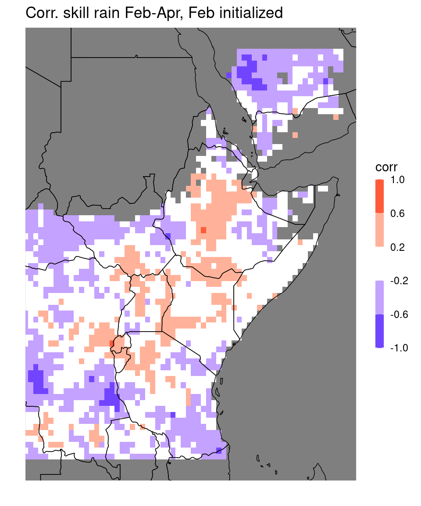
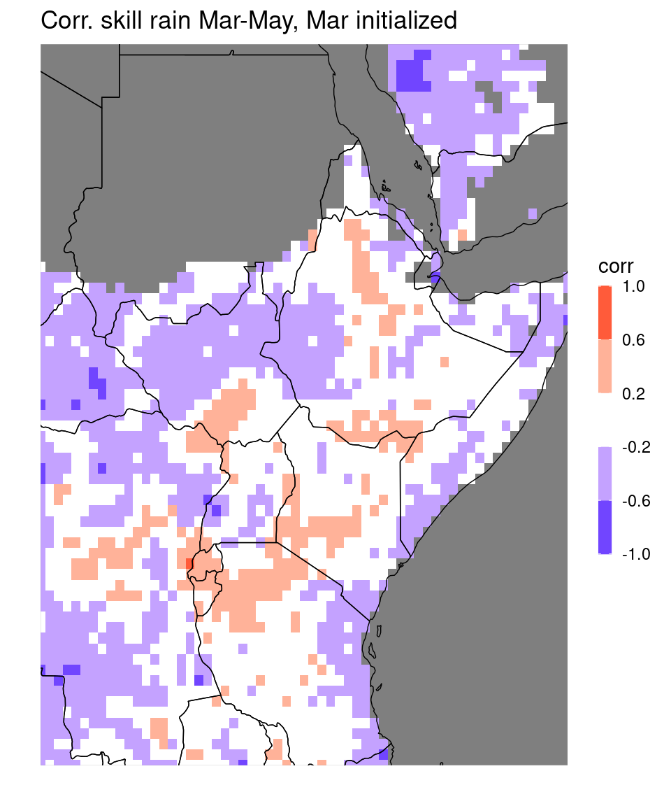
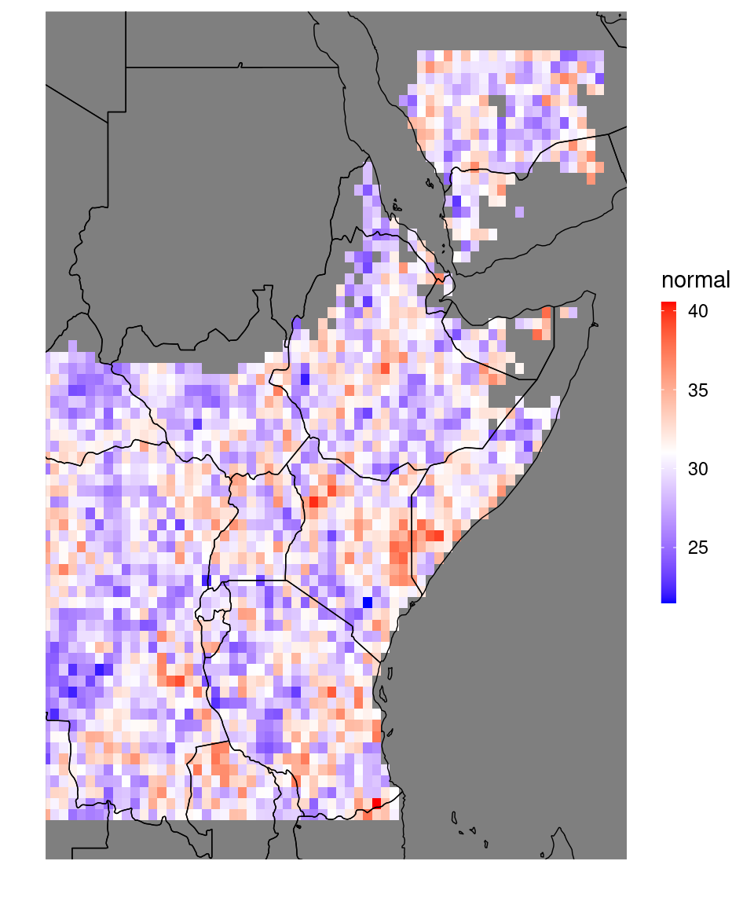
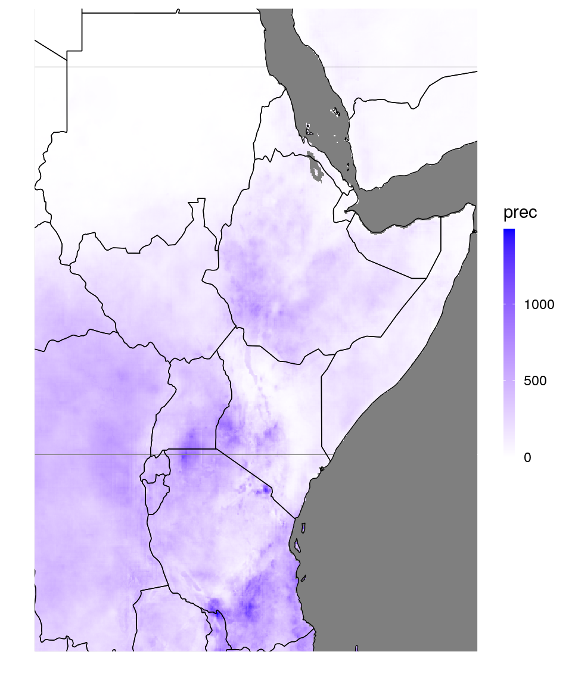
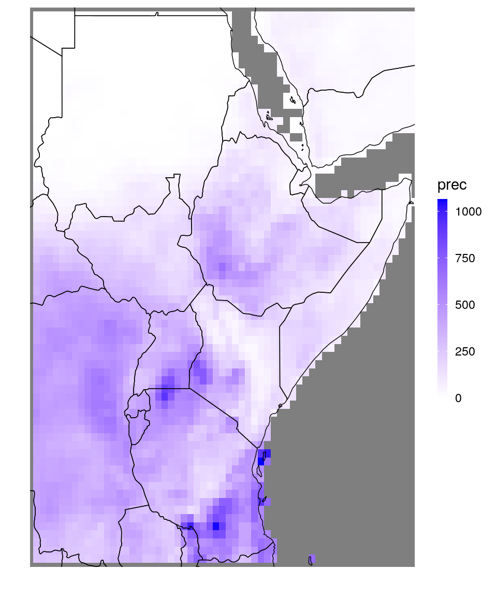
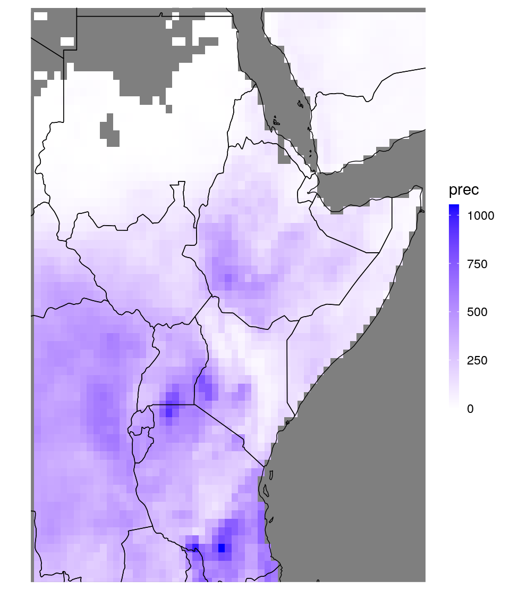
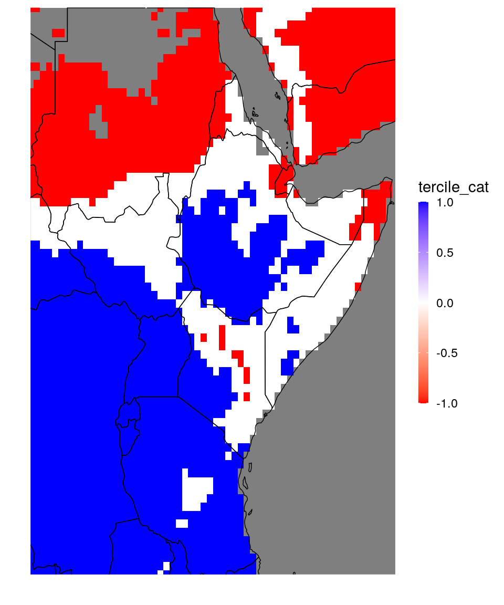

# Data import and processing


In this section we look at how to import netcdf-data as data tables, and how to get the data into the shape we need.

## The function `netcdf_to_dt` {#netcdf_to_dt}

The central function for importing netcdf-data as data.table is called `netcdf_to_dt`. It takes a filename of a netcdf (including directory path) as argument.
The example files we consider are hosted on ICPACs ftp server at SharedData/gcm/seasonal/202102.


```r
print(data_dir) # the directory the data is stored in, you need to adjust this to your platform.
```

```
## [1] "/nr/project/stat/CONFER/Data/validation/example_data/202102/"
```

```r
fn = "CorrelationSkillRain_Feb-Apr_Feb2021.nc"
dt = netcdf_to_dt(paste0(data_dir,fn))
```

```
## File /nr/project/stat/CONFER/Data/validation/example_data/202102/CorrelationSkillRain_Feb-Apr_Feb2021.nc (NC_FORMAT_CLASSIC):
## 
##      1 variables (excluding dimension variables):
##         float corr[lon,lat]   
##             lead: 0
##             average_op_ncl: dim_avg_n over dimension(s): model
##             type: 0
##             time: 13
##             _FillValue: -9999
## 
##      3 dimensions:
##         time  Size:0   *** is unlimited ***
## [1] "vobjtovarid4: **** WARNING **** I was asked to get a varid for dimension named time BUT this dimension HAS NO DIMVAR! Code will probably fail at this point"
##         lat  Size:77
##             units: degrees_north
##         lon  Size:66
##             units: degrees_east
## 
##     6 global attributes:
##         units: mm
##         MonInit_month: 2
##         valid_time: Feb-Apr
##         creation_date: Mon Feb 15 06:59:57 EAT 2021
##         Conventions: None
##         title:  Correlation between Cross-Validated and Observed Rainfall
```

```r
print(dt)
```

```
##        lon   lat corr
##    1: 20.5 -13.5   NA
##    2: 21.0 -13.5   NA
##    3: 21.5 -13.5   NA
##    4: 22.0 -13.5   NA
##    5: 22.5 -13.5   NA
##   ---                
## 5078: 51.0  24.5   NA
## 5079: 51.5  24.5   NA
## 5080: 52.0  24.5   NA
## 5081: 52.5  24.5   NA
## 5082: 53.0  24.5   NA
```

By default, the function prints out all the information it gets from the netcdf, including units, array sizes etc. 
This can be turned off by the `verbose` argument of the function: setting it to 0 supresses all messages, setting it to 1 only prints units of the variables. The default value is 2.

A netcdf file always contains *variables* (such as precip or temperature) and *dimension variables* (such as longitude or time). The function `netcdf_to_dt` by default tries to extract all variables into a single data table that also contains all dimension variables that are indexing at least one variable: For example, the netcdf file above has three dimension variables: lon,lat, and time (which is empty). It has one variable ('corr') that is indexed by lon and lat, therefore the resulting data table has three columns: corr, lon and lat.

The default behavior of merging all netcdf data into a single data table may sometimes be inappropriate. Say, for example, we have a netcdf with three dimension variables lon,lat and time, and it has a variable precipitation[lon,lat,time] and a second variable grid_point_index[lon,lat]. The resulting data table would have the columns lon,lat,time,precipitation, and grid_point_index.
This is not very memory efficient because the grid_point_indices are repeated for every instance of time. Moreover, in this case we probably don't need the grid_point_index anyway. We can use the `vars` argument of the `netcdf_to_dt` function to extract only selected variables. So, in this example, `netcdf_to_dt('example_file.nc', vars = 'precipitation')` would have done the trick.

Merging the data tables for all variables is particularly memory efficient when you have multiple variables that have different dimension variables. For large netcdfs with many variables and many dimension variables this can easily get out of hand. In this case you can use `netcdf_to_dt('example_file.nc',trymerge = FALSE)`. This will return a list of data tables, one data table for each variable, containing only the variable values and the dimension variables it is indexed by. If you have two or more variables that do not share a dimension variable, the function requires you to set `trymerge = FALSE`, see the example in Section \@ref(ex-corrupted-netcdf).

For the example above, the resulting data table looks like this:


```r
ggplot_dt(dt,
          mn = 'Corr. skill rain Feb-Apr, Feb initialized', # title
          rr = c(-1,1), # range of the colorbar
          discrete_cs = TRUE,binwidth = 0.4) # discretize colorbar
```



Note that the area shown by `ggplot_dt` is always the full extend of the data contained in the data table. In particular, the correlation plot above extends beyond areas where we have data, because the netcdf-file contained these locations (with missing values in the 'corr'-array). To just plot a window taylored to the data that is not missing, we can simply suppress the missing values by using `dt[!is.na(corr)]`.
We can compare to the February initialized forecast for March to May:


```r
fn = "CorrelationSkillRain_Mar-May_Feb2021.nc"

dt = netcdf_to_dt(paste0(data_dir,fn),verbose = 0) 

ggplot_dt(dt[!is.na(corr)], # here we suppress missing values
          mn = 'Corr. skill rain Mar-May, Mar initialized', # title
          rr = c(-1,1), # range of the colorbar
          discrete_cs = TRUE,binwidth = 0.4) # discretize colorbar
```



Similarly, for writing netcdf files from data tables, the package has a function `dt_to_netcdf`. The function requires a data table as input as well as the names of the columns containing the variables and dimension variables, and a filename to write to. The function will prompt you for units for all variables, but otherwise does not allow to include detailed descriptions in the netcdf. It also currently does not support writing netcdfs with multiple variables that have different dimension variables. You can use the Rpackage `ncdf4` for that.


## Reshaping data {#data-examples}

For forecast validation, the ideal data format is to have all your fore- and hindcasts in the same data table, alongside the corresponding observations. So one column of forecasts, one column of observations and several columns of dimension variables (e.g. year, month, lon,lat). However, this is rarely how your netcdf-data looks like: you'll often have different netcdfs for observations and fore-/hindcasts. They might, moreover have different units, different missing values, different variable names etc.

So to get your data into the preferred shape, you either need to manipulate the netcdf files beforehand, to get exactly the data table you want from `netcdf_to_dt`, or you can extract several data tables and do the required manipulations in `R`, using `SeaVal` and `data.table`. In this section we show a few examples for this.

### Example: cross-validation data {#cv-data}

In our example folder (see above) we have two crossvalidation datasets and corresponding observations (one for FMA, one for MAM). 
We will process them simultaneously here, merging everything into one single data table.  
This is not really making things easier and not generally recommended. It is a great way for us to highlight more `data.table`-syntax, though.


```r
# get the two CV-files:
fn_pred1 = "CrossValidatedPredictedRain_Feb-Apr_Feb2021.nc"
fn_pred2 = "CrossValidatedPredictedRain_Mar-May_Feb2021.nc"

dt_pred1 = netcdf_to_dt(paste0(data_dir,fn_pred1),verbose = 0) # they look the same, we can just look at the information from one of them:
dt_pred2 = netcdf_to_dt(paste0(data_dir,fn_pred2))
```

```
## File /nr/project/stat/CONFER/Data/validation/example_data/202102/CrossValidatedPredictedRain_Mar-May_Feb2021.nc (NC_FORMAT_CLASSIC):
## 
##      1 variables (excluding dimension variables):
##         float prec[lon,lat,time]   
##             lead: 1
##             average_op_ncl: dim_avg_n over dimension(s): model
##             type: 1
##             _FillValue: -9999
## 
##      3 dimensions:
##         time  Size:35   *** is unlimited ***
##             units: months since 1981-01-01 
##             calendar: standard
##             _FillValue: 9.96920996838687e+36
##         lat  Size:77
##             units: degrees_north
##         lon  Size:66
##             units: degrees_east
## 
##     6 global attributes:
##         units: mm
##         MonInit_month: 2
##         valid_time: Mar-May
##         creation_date: Mon Feb 15 06:59:57 EAT 2021
##         Conventions: None
##         title:  Cross Validated Predicted Rainfall Total (mm)
```

```r
#this is how our data looks now:
print(dt_pred1)
```

```
##          lon   lat time prec
##      1: 20.5 -13.5   13   NA
##      2: 21.0 -13.5   13   NA
##      3: 21.5 -13.5   13   NA
##      4: 22.0 -13.5   13   NA
##      5: 22.5 -13.5   13   NA
##     ---                     
## 177866: 51.0  24.5  421   NA
## 177867: 51.5  24.5  421   NA
## 177868: 52.0  24.5  421   NA
## 177869: 52.5  24.5  421   NA
## 177870: 53.0  24.5  421   NA
```

```r
# before joining the two data tables, we should add a column identifying which is which:
dt_pred1[,season:= 'FMA']
dt_pred2[,season:= 'MAM']

# bind together
dt_pred = rbindlist(list(dt_pred1,dt_pred2))
print(dt_pred)
```

```
##          lon   lat time prec season
##      1: 20.5 -13.5   13   NA    FMA
##      2: 21.0 -13.5   13   NA    FMA
##      3: 21.5 -13.5   13   NA    FMA
##      4: 22.0 -13.5   13   NA    FMA
##      5: 22.5 -13.5   13   NA    FMA
##     ---                            
## 355736: 51.0  24.5  421   NA    MAM
## 355737: 51.5  24.5  421   NA    MAM
## 355738: 52.0  24.5  421   NA    MAM
## 355739: 52.5  24.5  421   NA    MAM
## 355740: 53.0  24.5  421   NA    MAM
```

The function `rbindlist` binds a list of several data tables into one. This only works if they have the same columns, though, otherwise you need to use `merge`.


```r
# next, get the observations:
fn_obs1 = "ObservedRain_Feb-Apr_Feb2021.nc"
fn_obs2 = "ObservedRain_Mar-May_Feb2021_update.nc"
dt_obs1 = netcdf_to_dt(paste0(data_dir,fn_obs1),verbose = 0)
dt_obs2 = netcdf_to_dt(paste0(data_dir,fn_obs2) )
```

```
## File /nr/project/stat/CONFER/Data/validation/example_data/202102/ObservedRain_Mar-May_Feb2021_update.nc (NC_FORMAT_CLASSIC):
## 
##      1 variables (excluding dimension variables):
##         float prec[lon,lat,time]   
##             lead: 1
##             average_op_ncl: dim_avg_n over dimension(s): model
##             type: 0
##             _FillValue: -9999
## 
##      3 dimensions:
##         time  Size:35   *** is unlimited ***
##             units: months since 1981-01-01 
##             calendar: 360_day
##             _FillValue: 9.96920996838687e+36
##         lat  Size:77
##             units: degrees_north
##         lon  Size:66
##             units: degrees_east
## 
##     8 global attributes:
##         units: mm
##         MonInit_month: 2
##         valid_time: Mar-May
##         creation_date: Mon Feb 15 06:59:57 EAT 2021
##         Conventions: None
##         title:  Observed Rainfall Total (mm) 
##         history: Tue Feb 16 12:38:58 2021: ncatted -a calendar,time,o,c,360_day /dump/SharedData/gcm/seasonal/202102/ObservedRain_Mar-May_Feb2021.nc /dump/SharedData/gcm/seasonal/202102/ObservedRain_Mar-May_Feb2021_update.nc
##         NCO: netCDF Operators version 4.7.5 (Homepage = http://nco.sf.net, Code = http://github.com/nco/nco)
```

```r
dt_obs1[,season := 'FMA']
dt_obs2[,season := 'MAM']
dt_obs = rbindlist(list(dt_obs1,dt_obs2))
```

Now we have two data tables, one with predictions and one with observations. We want to join them, but we want to have predictions next to observations, so `rbindlist` does not work for us here, and we need to use `merge`. However, we should first make sure that the columns are named appropriately: Currently, both `dt_obs` and `dt_pred` have a column named `prec`.


```r
setnames(dt_pred,'prec','prediction')
setnames(dt_obs,'prec','observation')

dt = merge(dt_pred,dt_obs,by = c('lon','lat','time','season'))
print(dt)
```

```
##          lon   lat time season prediction observation
##      1: 20.5 -13.5   13    FMA         NA          NA
##      2: 20.5 -13.5   13    MAM         NA          NA
##      3: 20.5 -13.5   25    FMA         NA          NA
##      4: 20.5 -13.5   25    MAM         NA          NA
##      5: 20.5 -13.5   37    FMA         NA          NA
##     ---                                              
## 355736: 53.0  24.5  397    MAM         NA          NA
## 355737: 53.0  24.5  409    FMA         NA          NA
## 355738: 53.0  24.5  409    MAM         NA          NA
## 355739: 53.0  24.5  421    FMA         NA          NA
## 355740: 53.0  24.5  421    MAM         NA          NA
```

```r
# remove all rows with missing predictions:
dt = dt[!is.na(prediction)]

# convert time from the 'months since date' (MSD) format to years and months (YM)
dt = MSD_to_YM(dt,origin = '1981-01-01') # (the origin was documented in the netcdf, see above.)
print(dt) 
```

```
##          lon   lat season prediction observation year month
##      1: 20.5 -11.5    FMA  316.19452   369.36932 1982     2
##      2: 20.5 -11.5    MAM  202.94411   208.28058 1982     2
##      3: 20.5 -11.5    FMA  316.20178   252.47144 1983     2
##      4: 20.5 -11.5    MAM  205.24921   161.22548 1983     2
##      5: 20.5 -11.5    FMA  317.43375   267.44031 1984     2
##     ---                                                    
## 167330: 51.5  22.5    FMA   25.44651    19.71902 2012     2
## 167331: 51.5  22.5    FMA   25.59836    27.55773 2013     2
## 167332: 51.5  22.5    FMA   26.03941    25.14965 2014     2
## 167333: 51.5  22.5    FMA   26.03053    22.23634 2015     2
## 167334: 51.5  22.5    FMA   26.00327    34.84376 2016     2
```
We now have the data table in the shape we want it to be, containing both predictions and observations as one column each. In section \@ref(cv-eval) we show how to evaluate the predictions.


### Example: 'corrupted' netcdf{#ex-corrupted-netcdf}

Data handling can be messy and things can go wrong at any stage. Here, we have a look at a netcdf file where something has gone wrong:


```r
fn = "PredictedProbabilityRain_Feb-Apr_Feb2021.nc"
dt = netcdf_to_dt(paste0(data_dir,fn))
```

```
## File /nr/project/stat/CONFER/Data/validation/example_data/202102/PredictedProbabilityRain_Feb-Apr_Feb2021.nc (NC_FORMAT_CLASSIC):
## 
##      3 variables (excluding dimension variables):
##         float below[lon,lat]   
##             lead: 0
##             average_op_ncl: dim_avg_n over dimension(s): model
##             type: 0
##             _FillValue: -1
##         float normal[ncl4,ncl3]   
##             _FillValue: -1
##         float above[lon,lat]   
##             lead: 0
##             average_op_ncl: dim_avg_n over dimension(s): model
##             type: 2
##             _FillValue: -1
## 
##      5 dimensions:
##         time  Size:0   *** is unlimited ***
## [1] "vobjtovarid4: **** WARNING **** I was asked to get a varid for dimension named time BUT this dimension HAS NO DIMVAR! Code will probably fail at this point"
##         lat  Size:77
##             units: degrees_north
##         lon  Size:66
##             units: degrees_east
##         ncl3  Size:77
## [1] "vobjtovarid4: **** WARNING **** I was asked to get a varid for dimension named ncl3 BUT this dimension HAS NO DIMVAR! Code will probably fail at this point"
##         ncl4  Size:66
## [1] "vobjtovarid4: **** WARNING **** I was asked to get a varid for dimension named ncl4 BUT this dimension HAS NO DIMVAR! Code will probably fail at this point"
## 
##     6 global attributes:
##         units: mm
##         MonInit_month: 2
##         valid_time: Mar-May
##         creation_date: Mon Feb 15 06:59:57 EAT 2021
##         Conventions: None
##         title: Predicted Tercile probability
```

```
## Error in netcdf_to_dt(paste0(data_dir, fn)): Your file has variables with disjoint dimensions, which should not be stored in a single data table. Either set trymerge to FALSE or select variables with overlapping dimensions in vars.
```

The `netcdf_to_dt` function prints out the netcdf information, and then crashes with the error message above, saying that we have disjoint dimension variables for some variables. Indeed, looking at the printed out netcdf-description, we have three variables (below,normal,above), and while 'below' and 'above' are indexed by 'lon' and 'lat', 'normal' is indexed by 'ncl3' and 'ncl4'. As the error message suggests, we can set `trymerge` to FALSE, making `netcdf_to_dt` return a list of data tables. 


```r
dt_list = netcdf_to_dt(paste0(data_dir,fn),trymerge = FALSE,verbose = 0)
print(dt_list)
```

```
## [[1]]
##        lon   lat below
##    1: 20.5 -13.5    NA
##    2: 21.0 -13.5    NA
##    3: 21.5 -13.5    NA
##    4: 22.0 -13.5    NA
##    5: 22.5 -13.5    NA
##   ---                 
## 5078: 51.0  24.5    NA
## 5079: 51.5  24.5    NA
## 5080: 52.0  24.5    NA
## 5081: 52.5  24.5    NA
## 5082: 53.0  24.5    NA
## 
## [[2]]
##       ncl4 ncl3 normal
##    1:    1    1     NA
##    2:    2    1     NA
##    3:    3    1     NA
##    4:    4    1     NA
##    5:    5    1     NA
##   ---                 
## 5078:   62   77     NA
## 5079:   63   77     NA
## 5080:   64   77     NA
## 5081:   65   77     NA
## 5082:   66   77     NA
## 
## [[3]]
##        lon   lat above
##    1: 20.5 -13.5    NA
##    2: 21.0 -13.5    NA
##    3: 21.5 -13.5    NA
##    4: 22.0 -13.5    NA
##    5: 22.5 -13.5    NA
##   ---                 
## 5078: 51.0  24.5    NA
## 5079: 51.5  24.5    NA
## 5080: 52.0  24.5    NA
## 5081: 52.5  24.5    NA
## 5082: 53.0  24.5    NA
```

We see that 'ncl3' and 'ncl4' have different values than 'lon' and 'lat', apparently they are meaningless indexing integers. However, the three data.tables are of the same size, and we can hope that the 'below' data table is arranged in the same row-ordering than the others. If this is the case, we can simply extract the 'normal' column from it (as vector) and attach it to one of the others. Let's try:


```r
dt = dt_list[[1]]
normal_probs_as_vector = dt_list[[2]][,normal]
dt[,normal := normal_probs_as_vector]

ggplot_dt(dt,'normal')
```


Plotting is usually a great way to see whether data got arranged correctly:  Here, we can be fairly certain it did, simply because the missing values in the 'normal' vector are at the locations where they should be (over water and dry regions). If the ordering would have been differently, these would be all over the place. However, let's run another test to be certain:


```r
# attach the 'above'-data table:
dt = merge(dt,dt_list[[3]],by = c('lon','lat'))
print(dt)
```

```
##        lon   lat    below   normal    above
##    1: 20.5 -13.5       NA       NA       NA
##    2: 20.5 -13.0       NA       NA       NA
##    3: 20.5 -12.5       NA       NA       NA
##    4: 20.5 -12.0       NA       NA       NA
##    5: 20.5 -11.5 31.13112 35.07441 33.79448
##   ---                                      
## 5078: 53.0  22.5       NA       NA       NA
## 5079: 53.0  23.0       NA       NA       NA
## 5080: 53.0  23.5       NA       NA       NA
## 5081: 53.0  24.0       NA       NA       NA
## 5082: 53.0  24.5       NA       NA       NA
```

```r
# if the ordering of the 'normal' column was correct, we have below + normal + above = 100%:
check = rowSums(dt[,.(below,normal,above)])
print(check[1:20])
```

```
##  [1]  NA  NA  NA  NA 100 100 100 100 100 100 100 100 100 100 100 100 100 100 100
## [20] 100
```

```r
mean(check[!is.na(check)])
```

```
## [1] 100
```

We were lucky and the ordering was correct. Is there anything we could have done otherwise? Well, yes, we could have just used $\text{below} + \text{normal} + \text{above} = 100\%$ right away:


```r
# only extract 'below' and 'above':
dt = netcdf_to_dt(paste0(data_dir,fn), vars = c('below','above'),verbose = 0)
print(dt)
```

```
##        lon   lat    below    above
##    1: 20.5 -13.5       NA       NA
##    2: 20.5 -13.0       NA       NA
##    3: 20.5 -12.5       NA       NA
##    4: 20.5 -12.0       NA       NA
##    5: 20.5 -11.5 31.13112 33.79448
##   ---                             
## 5078: 53.0  22.5       NA       NA
## 5079: 53.0  23.0       NA       NA
## 5080: 53.0  23.5       NA       NA
## 5081: 53.0  24.0       NA       NA
## 5082: 53.0  24.5       NA       NA
```

```r
dt[,normal := 100 - below - above]
ggplot_dt(dt,'normal')
```




### Example: Upscaling observations {#us-obs}

Here we prepare a dataset for evaluating tercile forecasts for the MAM season: In our example data directory `data_dir` (given above) there are three datasets we need to combine to this end. Predictions, past observations and the 2021-observation. Note that we require past observations in order to find the climatology terciles, so that we can check whether the observed rainfall at a gridpoint is indeed 'high' or 'low' for that gridpoint.,
Our main challenge is that the 2021-observation file looks quite different from the others. In particular it is on a grid with higher resolution. 


```r
# get predictions:
dt = netcdf_to_dt(paste0(data_dir,'PredictedProbabilityRain_Mar-May_Feb2021_new.nc'))
```

```
## File /nr/project/stat/CONFER/Data/validation/example_data/202102/PredictedProbabilityRain_Mar-May_Feb2021_new.nc (NC_FORMAT_NETCDF4):
## 
##      3 variables (excluding dimension variables):
##         float normal[lon,lat]   (Contiguous storage)  
##             _FillValue: -1
##         float above[lon,lat]   (Contiguous storage)  
##             _FillValue: -1
##             lead: 1
##             average_op_ncl: dim_avg_n over dimension(s): model
##             type: 2
##         float below[lon,lat]   (Contiguous storage)  
##             _FillValue: -1
##             lead: 1
##             average_op_ncl: dim_avg_n over dimension(s): model
##             type: 0
## 
##      2 dimensions:
##         lat  Size:77
##             _FillValue: NaN
##             units: degrees_north
##         lon  Size:66
##             _FillValue: NaN
##             units: degrees_east
```

```r
print(dt)
```

```
##        lon   lat   normal    above    below
##    1: 20.5 -13.5       NA       NA       NA
##    2: 20.5 -13.0       NA       NA       NA
##    3: 20.5 -12.5       NA       NA       NA
##    4: 20.5 -12.0       NA       NA       NA
##    5: 20.5 -11.5 34.11535 33.56262 32.32204
##   ---                                      
## 5078: 53.0  22.5       NA       NA       NA
## 5079: 53.0  23.0       NA       NA       NA
## 5080: 53.0  23.5       NA       NA       NA
## 5081: 53.0  24.0       NA       NA       NA
## 5082: 53.0  24.5       NA       NA       NA
```

```r
# past observations:
dt_obs = netcdf_to_dt(paste0(data_dir,'ObservedRain_Mar-May_Feb2021.nc'))
```

```
## File /nr/project/stat/CONFER/Data/validation/example_data/202102/ObservedRain_Mar-May_Feb2021.nc (NC_FORMAT_CLASSIC):
## 
##      1 variables (excluding dimension variables):
##         float prec[lon,lat,time]   
##             lead: 1
##             average_op_ncl: dim_avg_n over dimension(s): model
##             type: 0
##             _FillValue: -9999
## 
##      3 dimensions:
##         time  Size:35   *** is unlimited ***
##             units: months since 1981-01-01 
##             calendar: standard
##             _FillValue: 9.96920996838687e+36
##         lat  Size:77
##             units: degrees_north
##         lon  Size:66
##             units: degrees_east
## 
##     6 global attributes:
##         units: mm
##         MonInit_month: 2
##         valid_time: Mar-May
##         creation_date: Mon Feb 15 06:59:57 EAT 2021
##         Conventions: None
##         title:  Observed Rainfall Total (mm)
```

```r
# 2021 observation:
dt_obs2021 = netcdf_to_dt(paste0(data_dir,'ObservedChirpsRainTotal_MAM2021.nc'),vars = 'precip')
```

```
## File /nr/project/stat/CONFER/Data/validation/example_data/202102/ObservedChirpsRainTotal_MAM2021.nc (NC_FORMAT_NETCDF4):
## 
##      2 variables (excluding dimension variables):
##         double time_bnds[bnds,time]   (Chunking: [2,1])  
##         float precip[longitude,latitude,time]   (Chunking: [592,1,1])  
##             standard_name: convective precipitation rate
##             long_name: Climate Hazards group InfraRed Precipitation with Stations
##             units: mm/day
##             _FillValue: -9999
##             missing_value: -9999
##             time_step: day
##             geostatial_lat_min: -50
##             geostatial_lat_max: 50
##             geostatial_lon_min: -180
##             geostatial_lon_max: 180
## 
##      4 dimensions:
##         longitude  Size:592
##             standard_name: longitude
##             long_name: longitude
##             units: degrees_east
##             axis: X
##         latitude  Size:679
##             standard_name: latitude
##             long_name: latitude
##             units: degrees_north
##             axis: Y
##         time  Size:1   *** is unlimited ***
##             standard_name: time
##             bounds: time_bnds
##             units: days since 1980-1-1 0:0:0
##             calendar: standard
##             axis: T
##         bnds  Size:2
## [1] "vobjtovarid4: **** WARNING **** I was asked to get a varid for dimension named bnds BUT this dimension HAS NO DIMVAR! Code will probably fail at this point"
## 
##     18 global attributes:
##         CDI: Climate Data Interface version 1.9.0 (http://mpimet.mpg.de/cdi)
##         history: Wed Jun 23 10:40:15 2021: cdo -L sellonlatbox,21.81,51.41,-11.72,22.23 -mulc,92 -timmean -selmon,3/5 chirps-v2.0.20210101-20210531.mon_p05_GHA.nc r_MAM_Tot_2021.nc
## Tue Jun 22 15:01:48 2021: cdo monmean chirps-v2.0.20210101-20210531.days_p05_GHA.nc chirps-v2.0.20210101-20210531.mon_p05_GHA.nc
## Tue Jun 22 14:49:19 2021: cdo remapbil,chrips_gha.txt /home/hussen/Downloads/CHIRPS/chirps-v2.0.2021.days_p05.nc chirps-v2.0.20210101-20210531.days_p05_GHA.nc
## created by Climate Hazards Group
##         institution: Climate Hazards Group.  University of California at Santa Barbara
##         Conventions: CF-1.6
##         title: CHIRPS Version 2.0
##         version: Version 2.0
##         date_created: 2021-06-16
##         creator_name: Pete Peterson
##         creator_email: pete@geog.ucsb.edu
##         documentation: http://pubs.usgs.gov/ds/832/
##         reference: Funk, C.C., Peterson, P.J., Landsfeld, M.F., Pedreros, D.H., Verdin, J.P., Rowland, J.D., Romero, B.E., Husak, G.J., Michaelsen, J.C., and Verdin, A.P., 2014, A quasi-global precipitation time series for drought monitoring: U.S. Geological Survey Data Series 832, 4 p., http://dx.doi.org/110.3133/ds832. 
##         comments:  time variable denotes the first day of the given day. Improved October 2015.
##         acknowledgements: The Climate Hazards Group InfraRed Precipitation with Stations development process was carried out through U.S. Geological Survey (USGS) cooperative agreement #G09AC000001 "Monitoring and Forecasting Climate, Water and Land Use for Food Production in the Developing World" with funding from: U.S. Agency for International Development Office of Food for Peace, award #AID-FFP-P-10-00002 for "Famine Early Warning Systems Network Support," the National Aeronautics and Space Administration Applied Sciences Program, Decisions award #NN10AN26I for "A Land Data Assimilation System for Famine Early Warning," SERVIR award #NNH12AU22I for "A Long Time-Series Indicator of Agricultural Drought for the Greater Horn of Africa," The National Oceanic and Atmospheric Administration award NA11OAR4310151 for "A Global Standardized Precipitation Index supporting the US Drought Portal and the Famine Early Warning System Network," and the USGS Land Change Science Program.
##         ftp_url: ftp://chg-ftpout.geog.ucsb.edu/pub/org/chg/products/CHIRPS-latest/
##         website: http://chg.geog.ucsb.edu/data/chirps/index.html
##         faq: http://chg-wiki.geog.ucsb.edu/wiki/CHIRPS_FAQ
##         frequency: mon
##         CDO: Climate Data Operators version 1.9.0 (http://mpimet.mpg.de/cdo)
```

```r
# the 2021 observation is named differently...
setnames(dt_obs2021,c('longitude','latitude','precip'),c('lon','lat','prec'))
# ... and it is on higher resolution:
ggplot_dt(dt_obs2021,'prec',high = 'blue',midpoint = 0)
```

```
## Warning: Raster pixels are placed at uneven horizontal intervals and will be
## shifted. Consider using geom_tile() instead.
```

```
## Warning: Raster pixels are placed at uneven vertical intervals and will be
## shifted. Consider using geom_tile() instead.
```



```r
# we can upscale it to half-degree-resolution using the following function:
dt_obs2021 = upscale_to_half_degrees(dt_obs2021,uscol = 'prec',bycols = 'time')
```

```
## [1] "1/1"
```

```r
ggplot_dt(dt_obs2021,high = 'blue',midpoint = 0)
```



```r
# the time format is different for the two observation data tables, see netcdf description above.
# For dt_obs the format is month since date, and can be changed to year-month like this:
dt_obs = MSD_to_YM(dt_obs)
# For dt_obs2021 it's the number of days since 1980-01-01, and we can do the following:
dt_obs2021[,date := as.Date(time,origin = '1980-01-01')] # see netcdf description above
dt_obs2021[,year := year(date)][,month := month(date)]
print(dt_obs2021)
```

```
##        lon   lat     prec    time       date year month
##    1: 21.5 -12.0       NA 15080.5 2021-04-15 2021     4
##    2: 21.5 -11.5       NA 15080.5 2021-04-15 2021     4
##    3: 21.5 -11.0       NA 15080.5 2021-04-15 2021     4
##    4: 21.5 -10.5       NA 15080.5 2021-04-15 2021     4
##    5: 21.5 -10.0       NA 15080.5 2021-04-15 2021     4
##   ---                                                  
## 4266: 51.5  20.5 25.20947 15080.5 2021-04-15 2021     4
## 4267: 51.5  21.0 21.71183 15080.5 2021-04-15 2021     4
## 4268: 51.5  21.5 23.18140 15080.5 2021-04-15 2021     4
## 4269: 51.5  22.0 23.29202 15080.5 2021-04-15 2021     4
## 4270: 51.5  22.5       NA 15080.5 2021-04-15 2021     4
```

```r
# Next, let's restrict 2021-observations to locations that are not blanked out in the past observations:
na_locs = dt_obs[year == year[1],.(lon,lat,is.na(prec))]
print(na_locs)
```

```
##        lon   lat   V3
##    1: 20.5 -13.5 TRUE
##    2: 21.0 -13.5 TRUE
##    3: 21.5 -13.5 TRUE
##    4: 22.0 -13.5 TRUE
##    5: 22.5 -13.5 TRUE
##   ---                
## 5078: 51.0  24.5 TRUE
## 5079: 51.5  24.5 TRUE
## 5080: 52.0  24.5 TRUE
## 5081: 52.5  24.5 TRUE
## 5082: 53.0  24.5 TRUE
```

```r
dt_obs2021 = merge(dt_obs2021,na_locs,by = c('lon','lat'))
dt_obs2021 = dt_obs2021[!(V3)] # only keep rows for which V3 is FALSE
ggplot_dt(dt_obs2021, 'prec',high = 'blue',midpoint = 0)
```



```r
#delete what we don't need and bind together:
dt_obs[,month:=NULL]
dt_obs2021[,c('month','time','date','V3'):=NULL]

dt_obs = rbindlist(list(dt_obs,dt_obs2021),use.names = TRUE)
dt_obs = dt_obs[!is.na(prec)]

# in which climatology tercile lies the observation for which year?
dt_obs = add_tercile_cat(dt_obs) 
# let's also add the climatology for alter use:
dt_obs[,clim := mean(prec),by = .(lon,lat)]


ggplot_dt(dt_obs[year == 2021],'tercile_cat',low = 'red',high = 'blue')
```



```r
# merge prediction and corresponding observation:
dt = merge(dt,dt_obs[year == 2021],by = c('lon','lat'))
# transform percentage prediction to probabilities between zero and one:
dt[,normal := normal/100]
dt[,above := above/100]
dt[,below := below/100]

print(dt)
```

```
##        lon   lat    normal     above     below      prec year tercile_cat
##    1: 22.0 -11.5 0.2794044 0.3959641 0.3246315 271.66216 2021           1
##    2: 22.0 -11.0 0.3176142 0.3509704 0.3314154 279.13827 2021           1
##    3: 22.0 -10.5 0.2897301 0.3781255 0.3321443 300.32019 2021           1
##    4: 22.0 -10.0 0.3133837 0.3520903 0.3345260 332.45370 2021           1
##    5: 22.0  -9.5 0.3076811 0.3480890 0.3442299 407.19163 2021           1
##   ---                                                                    
## 2939: 51.5  20.0        NA        NA        NA  26.43442 2021           1
## 2940: 51.5  20.5        NA        NA        NA  25.20947 2021           1
## 2941: 51.5  21.0        NA        NA        NA  21.71183 2021           1
## 2942: 51.5  21.5        NA        NA        NA  23.18140 2021           1
## 2943: 51.5  22.0        NA        NA        NA  23.29202 2021           1
##            clim
##    1: 200.78224
##    2: 218.82563
##    3: 219.82354
##    4: 224.44427
##    5: 237.77492
##   ---          
## 2939:  14.02317
## 2940:  13.39437
## 2941:  13.75870
## 2942:  14.37246
## 2943:  17.47911
```

How to evaluate this dataset will be discussed in Section \@ref(eval-terciles).


Besides the function `upscale_to_half_degrees` there is another function called `upscale_nested_griddings` that is more general purpose and makes weaker assumptions about the grids, 


### Example: preparing data for evaluating exceedence probabilities{#data-ex-prexc}

Here we show how to prepare data for evaluating exceedence probabilities, see Section \@ref(eval-ex-pr).


```r
fn = 'PrecRegPeXcd_3monthSeasonal.nc'
dt = netcdf_to_dt(paste0(data_dir,fn))
```

```
## File /nr/project/stat/CONFER/Data/validation/example_data/202102/PrecRegPeXcd_3monthSeasonal.nc (NC_FORMAT_CLASSIC):
## 
##      1 variables (excluding dimension variables):
##         float pexcd[lon,lat,model,lead,rthr]   
##             thrhold4: 400
##             thrhold3: 350
##             thrhold2: 300
##             thrhold1: 200
##             units: %
##             _FillValue: -9999
## 
##      6 dimensions:
##         time  Size:0   *** is unlimited ***
## [1] "vobjtovarid4: **** WARNING **** I was asked to get a varid for dimension named time BUT this dimension HAS NO DIMVAR! Code will probably fail at this point"
##         rthr  Size:4
##         lead  Size:6
##             units: months since 2021-2-1 0:0 
##         model  Size:9
##             names: GEM-NEMO CanCM4i NASA-GEOSS2S GFDL-SPEAR COLA-RSMAS-CCSM4 NCEP-CFSv2 ECMWF Meteo_France UKMO
##         lat  Size:77
##             units: degrees_north
##         lon  Size:66
##             units: degrees_east
## 
##     5 global attributes:
##         modelnames: GEM-NEMO CanCM4i NASA-GEOSS2S GFDL-SPEAR COLA-RSMAS-CCSM4 NCEP-CFSv2 ECMWF Meteo_France UKMO
##         nmodels: 9
##         initial_time: Feb2021
##         creation_date: Thu Feb 25 19:58:57 EAT 2021
##         title:  Forecast probabilities of Exceedance
```

```r
print(dt)
```

```
##           lon   lat model lead rthr pexcd
##       1: 20.5 -13.5     0    0    0    NA
##       2: 21.0 -13.5     0    0    0    NA
##       3: 21.5 -13.5     0    0    0    NA
##       4: 22.0 -13.5     0    0    0    NA
##       5: 22.5 -13.5     0    0    0    NA
##      ---                                 
## 1097708: 51.0  24.5     8    5    3    NA
## 1097709: 51.5  24.5     8    5    3    NA
## 1097710: 52.0  24.5     8    5    3    NA
## 1097711: 52.5  24.5     8    5    3    NA
## 1097712: 53.0  24.5     8    5    3    NA
```

```r
# first, note that the 'model', 'rthr', and 'month' column do not make much sense before we insert
# the information we gather from the netcdf description.:
modelnames = c('GEM-NEMO',
               'CanCM4i',
               'NASA-GEOSS2S',
               'GFDL-SPEAR',
               'COLA-RSMAS-CCSM4',
               'NCEP-CFSv2',
               'ECMWF',
               'Meteo_France',
               'UKMO')
thresholds = c(200,300,350,400)

dt[,model := modelnames[model + 1]]
dt[,rthr := thresholds[rthr + 1]]
dt[,month :=lead + 2][,lead:=NULL]
```

Ultimately, we want to compare the skill of these models to a climatological forecast. The climatological forecast for the exceedence probability is just the fraction of observed years where the threshold was exceeded. To calculate this, we require past observations. These are not contained in our example data folder, so we cheat a little here and load in some chirps data. You can get this data (on high resolution) from here: http://digilib.icpac.net/SOURCES/.ICPAC/.CHIRPS-BLENDED/.monthly/.rainfall/.precipitation/. It can then be upscaled as shown in the last section. Our observation data looks like this:


```r
print(dt_chirps)
```

```
##          lon   lat     prec month year
##      1: 21.5 -12.0       NA     2 1981
##      2: 21.5 -11.5       NA     2 1981
##      3: 21.5 -11.0       NA     2 1981
##      4: 21.5 -10.5       NA     2 1981
##      5: 21.5 -10.0       NA     2 1981
##     ---                               
## 720284: 51.5  21.5 4.000000     5 2021
## 720285: 51.5  22.0 3.356522     5 2021
## 720286: 51.5  22.5 1.117393     5 2021
## 720287: 51.5  23.0 1.510869     5 2021
## 720288: 51.5  23.5       NA     5 2021
```

In order to get the climatological exceedence probabilities, we can use the following function:

```r
clim_fc = climatology_threshold_exceedence(dt_chirps,
                                           obs_col = 'prec',
                                           thresholds = unique(dt[,rthr]),
                                           by_cols = c('month','lon','lat'))

print(clim_fc)
```

```
##          month  lon   lat year pexcd threshold
##       1:     2 21.5 -12.0 1981    NA       200
##       2:     2 21.5 -11.5 1981    NA       200
##       3:     2 21.5 -11.0 1981    NA       200
##       4:     2 21.5 -10.5 1981    NA       200
##       5:     2 21.5 -10.0 1981    NA       200
##      ---                                      
## 2881148:     5 51.5  21.5 2021     0       400
## 2881149:     5 51.5  22.0 2021     0       400
## 2881150:     5 51.5  22.5 2021     0       400
## 2881151:     5 51.5  23.0 2021     0       400
## 2881152:     5 51.5  23.5 2021    NA       400
```

Note that we passed the thresholds given in `dt`. The `bycols` argument tells the function what columns to group by when computing the climatology. Finally, we need to merge the predictions, the climatological forecast and the observation into one data table. Since we only have predictions for 2021, it is enough to provide the climatology forecast and observation for 2021 as well. Also note that we have predictions for more months than observations (at the time this is written), so we cut the predictions for June and July out - we cannot evaluate predictions we don't know the outcome for.


```r
setnames(clim_fc,c('pexcd','threshold'),c('clim','rthr'))
dt = merge(dt,clim_fc[year == 2021,],by = c('lon','lat','month','rthr'))
dt = merge(dt,dt_chirps[year == 2021],by = c('lon','lat','month','year'))

#finally, for evaluation we generally work with probabilities between 0 and 1, not percentages:
range(dt[,pexcd],na.rm = TRUE) # confirm that the data table contains percentages at the moment...
```

```
## [1]   0 100
```

```r
dt[,pexcd := pexcd/100] #... and correct

print(dt)
```

```
##          lon   lat month year rthr            model pexcd clim prec
##      1: 21.5 -12.0     2 2021  200         GEM-NEMO 0.996   NA   NA
##      2: 21.5 -12.0     2 2021  200          CanCM4i 0.995   NA   NA
##      3: 21.5 -12.0     2 2021  200     NASA-GEOSS2S 0.996   NA   NA
##      4: 21.5 -12.0     2 2021  200       GFDL-SPEAR 0.990   NA   NA
##      5: 21.5 -12.0     2 2021  200 COLA-RSMAS-CCSM4 0.993   NA   NA
##     ---                                                            
## 632444: 51.5  23.5     5 2021  400 COLA-RSMAS-CCSM4 0.000   NA   NA
## 632445: 51.5  23.5     5 2021  400       NCEP-CFSv2 0.000   NA   NA
## 632446: 51.5  23.5     5 2021  400            ECMWF 0.000   NA   NA
## 632447: 51.5  23.5     5 2021  400     Meteo_France 0.000   NA   NA
## 632448: 51.5  23.5     5 2021  400             UKMO 0.000   NA   NA
```
How to evaluate the predictions from here is discussed in Section \@ref(eval-ex-pr).


