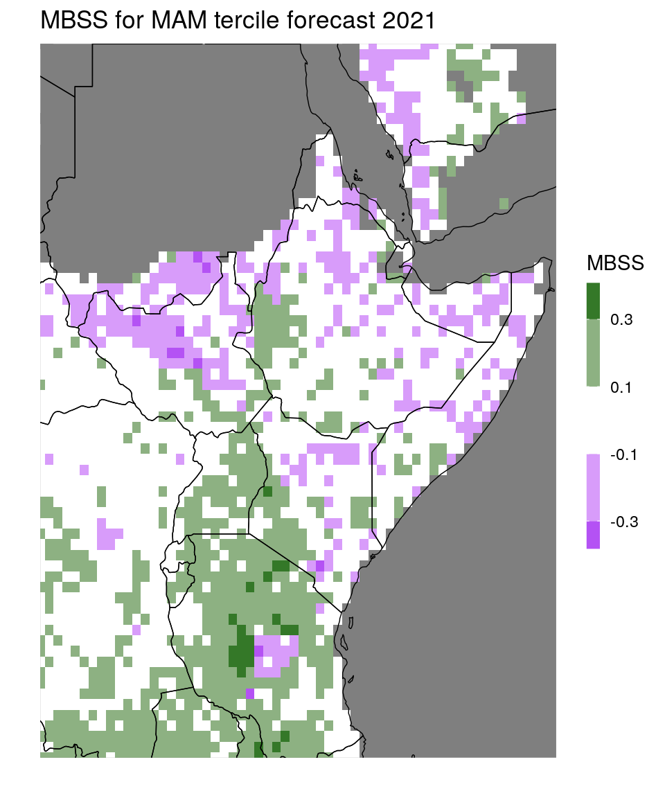

# Validation


In this section we look into validating different types of predictions. Our focus herby lies on comparison to climatology. 

## Evaluating cross-validation predictions

In this subsection we'll evaluate the predictions stored in the data table created in Section \@ref(cv-data).
The data table contains observations for past years for the seasons MAM and FMA, along with 'best-guess-predictions', meaning that they are single numbers, not probabilities:

```r
print(dt_cv)
```

```
##          lon   lat season prediction observation year month
##      1: 20.5 -11.5    FMA  316.19452   369.36932 1982     2
##      2: 20.5 -11.5    MAM  202.94411   208.28058 1982     2
##      3: 20.5 -11.5    FMA  316.20178   252.47144 1983     2
##      4: 20.5 -11.5    MAM  205.24921   161.22548 1983     2
##      5: 20.5 -11.5    FMA  317.43375   267.44031 1984     2
##     ---                                                    
## 167330: 51.5  22.5    FMA   25.44651    19.71902 2012     2
## 167331: 51.5  22.5    FMA   25.59836    27.55773 2013     2
## 167332: 51.5  22.5    FMA   26.03941    25.14965 2014     2
## 167333: 51.5  22.5    FMA   26.03053    22.23634 2015     2
## 167334: 51.5  22.5    FMA   26.00327    34.84376 2016     2
```
Such predictions are often called *point forecasts*, whereas forecasts specifying probabilities are called *probabilistic*. 
We already have the data in the shape we want it to be, containing both predictions and observations as one column each. Let's have a look at the bias in our predictions:


```r
### check out local biases ###
bias_dt = dt_cv[,.(bias = mean(prediction - observation)), by = .(lon,lat,season)] # grouping by lon,lat, and season means that the mean is taken over all years.
bias_dt[,range(bias)] # get an idea of the range for plotting
```

```
## [1] -12.64276  15.80456
```

```r
rr = c(-15,15) # fix range, to make plots comparable

pp1 = ggplot_dt(bias_dt[season == 'FMA'],
                data_col = 'bias', 
                rr = rr, # fix range to make it comparable to pp2
                mn = 'bias of FMA prediction',
                midpoint = 0)

pp2 = ggplot_dt(bias_dt[season == 'MAM'],
                data_col = 'bias', 
                rr = rr,
                mn = 'bias of MAM prediction',
                midpoint = 0)

# show plots:
ggarrange(pp1,pp2) # here we need the package ggpubr
```


We can use the function `MSESS_dt` to compute MSE skill scores. The skill is computed relative to leave-one-year-out climatology.


```r
### analyze mean square error skill scores ###
msess = MSESS_dt(dt_cv,
                 fc_col = 'prediction', # column name of forecasts
                 obs_col = 'observation', # column name of observations
                 by_cols = c('lon','lat','season')) # the skill scores should be computed for each location and each season separately

# get range for plotting:
msess[,range(MSESS)]
```

```
## [1] -0.3447786  0.3436327
```

```r
rr = c(-0.35,0.35)

pp1 = ggplot_dt(msess[season == 'FMA'], 
                data_col = 'MSESS', 
                rr=rr,
                mn = 'MSE skill score, FMA')

pp2 = ggplot_dt(msess[season == 'MAM'], 
                data_col = 'MSESS', 
                rr=rr,
                mn = 'MSE skill score, MAM')

ggarrange(pp1,pp2)
```


If we want to analyze results by countries, we can use the function `add_country_names` that adds a column with country names to the data table:


```r
# check out average MSEs and MSESSs per country:
msess = add_country_names(msess)
print(msess)
```

```
##        lon  lat season       MSE  clim_MSE        MSESS country
##    1: 23.0 11.0    MAM 303.14287 308.54726  0.017515586   Sudan
##    2: 23.5  9.0    MAM 751.99749 731.22747 -0.028404319   Sudan
##    3: 23.5 10.5    MAM 294.52421 297.75507  0.010850729   Sudan
##    4: 23.5 11.0    MAM 229.63428 228.55108 -0.004739428   Sudan
##    5: 24.0  9.0    MAM 426.41982 400.60929 -0.064428203   Sudan
##   ---                                                          
## 2703: 50.0 11.0    MAM 185.52785 200.07593  0.072712761 Somalia
## 2704: 50.5  9.5    MAM  48.67772  46.13510 -0.055112437 Somalia
## 2705: 50.5 10.0    MAM  28.67013  27.39041 -0.046721342 Somalia
## 2706: 50.5 11.0    MAM  55.81477  54.05239 -0.032604992 Somalia
## 2707: 50.5 11.5    MAM  60.25333  60.52558  0.004498041 Somalia
```

```r
msess_by_country = msess[,.(MSE = mean(MSE),
                            MSESS = mean(MSESS)), by = country] # take averages by country

print(msess_by_country)
```

```
##         country       MSE       MSESS
##  1:       Sudan  358.0374 0.015229343
##  2: South Sudan  901.2060 0.021752470
##  3:      Rwanda 1657.1758 0.129892834
##  4:    Tanzania 3588.8147 0.037472556
##  5:     Burundi 2263.1621 0.110301016
##  6:      Uganda 1578.1713 0.044870020
##  7:    Ethiopia 1863.0355 0.049708565
##  8:       Kenya 2404.1271 0.061263744
##  9:     Eritrea  447.6274 0.009834729
## 10:     Somalia 1121.8166 0.023641155
## 11:    Djibouti  111.1771 0.029694437
```

## Evaluating Tercile Forecasts

Next we'll turn to one of the main products disseminated at GHACOFs, the probabilistic forecasts whether the coming season will see a below normal-, normal-, or above normal amount of rainfall. Since these three categories are defined by climatological terciles, we call them tercile forecasts here. From an evaluation perspective, there are two different scenarios: Either we get the prediction as a vector of three probabilities, or we just get the probability for the most likely category. Evaluating a vector of three probabilities is preferrable because it conveys more detailed information about the forecast: Say, for example, two competing models predicted the probabilities (0.5, 0.3, 0.2) and (0.5, 0.49, 0.01), respectively (in the order below, normal, high). Say now, after observing the predicted season, it turns out that the rainfall was in fact above normal. In this case, both predictions were pretty bad, but the first model at least assigned a 20% chance to above-normal-rainfall, whereas the second model only assigned a 1% chance to that outcome. So the first prediction was substantially better. However, if we only look at the category with the highest predicted probability, the two models can't be distinguished as they both appear as (0.5,-,-).

Therefore, considering all three probabilities of the prediction allows for better forecast evaluation. This does not mean, however, that the communication of the prediction to the public needs to contain all three probabilities, which would likely be more confusing than helpful. In the next subsection we'll discuss how to evaluate a full probability forecast (vector of three probabilities). In the section thereafter we address the case where only the most likely category is known.

### Proper scoring rules for full tercile forecasts

Proper scoring rules are tools for evaluating predictive performance. Given a prediction and the corresponding observation, a proper score returns a single number. We consider negatively oriented scores, that is, lower scores indicate better performance. Popular examples are the Brier Score, Mean Square Error (MSE), Log-likelihood score or the continuous ranked probability score (CRPS).

When we're dealing with tercile forecasts of precipitation, we can use the *Multicategory Brier Score (MBS)*. It is defined as
\[\text{MBS} :=  (p_1 - e_1)^2 + (p_2 - e_2)^2 + (p_3 - e_3)^2.\]
Here, $p_1,p_2,$ and $p_3$ are the predicted probabilities for the three categories, and $e_i$ is 1 if the observation falls in the $i$th category, and 0 else. For example, if the observation falls into the first category, the MBS would be
\[(p_1 - 1)^2 + p_2^2 + p_3^2.\]

This score is strictly proper, meaning that it rewards calibration and accuracy. In our particular situation, the climatological forecast is uniform
(since climatology is used to define the tercile categories), and the climatological forecast (1/3,1/3,1/3) always gets a MBS of 2/3 = 0.67. 
It is therefore very convenient to consider the *Multicategory Brier Skill Score (MBSS)*
\[MBSS := \frac{3}{2}(2/3 - \text{MBS}).\]
As other skill scores, this score is normalized in the sense that a perfect forecaster attains a skill score of 1 and a climatology forecast always gets a skill score of 0.
Note that, for the MBSS, higher values indicate better performance, unlike for the MBS (similar as for other scores such as MSE).

Tercile forecasts are a particular situation where the skill score is a strictly proper scoring rule itself (albeit positively oriented). This means in particular that we may average Multicategory Brier Skill Scores accross different grid points without being concerned about different scales of precipitation.
If, for example, the average MBSS of our prediction over all gridpoints in Ethiopia is above 0, our prediction for Ethiopia was on average better than climatology.

Let's now look at a data example, contained in the `data_dir` specified [here](#netcdf_to_dt). The core function is simply called `MBSS_dt`. The main work was putting everything into one data table of the correct format, which we already did in Section \@ref(us-obs):


```r
dt = dt_tercile_forecast
print(dt)
```

```
##        lon   lat    normal     above     below      prec year tercile_cat
##    1: 22.0 -11.5 0.2794044 0.3959641 0.3246315 271.66216 2021           1
##    2: 22.0 -11.0 0.3176142 0.3509704 0.3314154 279.13827 2021           1
##    3: 22.0 -10.5 0.2897301 0.3781255 0.3321443 300.32019 2021           1
##    4: 22.0 -10.0 0.3133837 0.3520903 0.3345260 332.45370 2021           1
##    5: 22.0  -9.5 0.3076811 0.3480890 0.3442299 407.19163 2021           1
##   ---                                                                    
## 2939: 51.5  20.0        NA        NA        NA  26.43442 2021          -1
## 2940: 51.5  20.5        NA        NA        NA  25.20947 2021          -1
## 2941: 51.5  21.0        NA        NA        NA  21.71183 2021          -1
## 2942: 51.5  21.5        NA        NA        NA  23.18140 2021          -1
## 2943: 51.5  22.0        NA        NA        NA  23.29202 2021          -1
```

```r
# get Multicategory Brier Skill Score:
mbss = MBSS_dt(dt,obs_col = 'tercile_cat')
ggplot_dt(mbss,high = 'darkgreen',low = 'purple',discrete_cs = TRUE,binwidth = 0.2,midpoint = 0, mn = 'MBSS for MAM tercile forecast 2021')
```



Areas colored in green show where the prediction was better than climatology, areas colored in purple indicate worse performance. The MBSS indicates, for example, good forecast performance over most of Tanzania. 

To see whether the forecast was overall better than climatology, we average the MBSS:


```r
# check out the MBSS by country:
mbss = add_country_names(mbss)
mean_mbss = mbss[,.(mean_mbss = mean(MBSS,na.rm = T)), by = country]
print(mean_mbss)
```

```
##         country    mean_mbss
##  1:       Sudan -0.101016447
##  2: South Sudan -0.064356237
##  3:      Rwanda  0.061607937
##  4:    Tanzania  0.136468567
##  5:     Burundi  0.114454899
##  6:      Uganda  0.118914478
##  7:    Ethiopia -0.002694009
##  8:       Kenya  0.009083932
##  9:     Eritrea -0.045155095
## 10:     Somalia -0.033277965
## 11:    Djibouti  0.009452135
```

Finally, let's check whether this makes sense, by comparing climatology to the prediction:


```r
dt[,clim:= mean(prec),by = .(lon,lat)]
dt[,anomaly:= prec - clim]

ggplot_dt(dt[year == 2021],'anomaly',high = 'blue',low = 'red',midpoint = 0, mn = 'observed 2021 MAM precip anomaly')
```


```r
# or, as discrete plot:
pp1 = ggplot_dt(dt[year == 2021],'anomaly',
                high = 'blue',low = 'red',midpoint = 0,
                rr = c(-100,100),discrete_cs = TRUE,breaks = seq(-100,100,40),
                mn = 'observed 2021 MAM precip anomaly')

# also, let's plot the predicted probabilities:
pp2 = ggplot_dt(dt,'below',midpoint = 0.33,discrete_cs = TRUE,binwidth = 0.05,mn = 'predicted probability below')
pp3 = ggplot_dt(dt,'normal',midpoint = 0.33,discrete_cs = TRUE,binwidth = 0.05,mn = 'predicted probability normal')
pp4 = ggplot_dt(dt,'above',midpoint = 0.33,discrete_cs = TRUE,binwidth = 0.05,mn = 'predicted probability above')

ggpubr::ggarrange(pp1,pp2,pp3,pp4,ncol = 4)
```


As we can see, the season was very wet overall. The prediction was overall wet as well, especially over the western part of the considered region, where the prediction also got assigned a positive MBSS.

### Evaluation when only the highest probability category is avaliable

As argued above, it is preferrable to evaluate tercile forecasts that are given as full probability vector containing all three probabilities. However, we might still face scenarios where we only have the highest probability category available, e.g. some older forecasts for which only this has been saved. What can we do in this case?

Intuitively, a promising candidate for a proper score seems to be the two-category-Brier score on the category with the highest probability
\[BS_{\max} = (p_{\max}-e_{\max})^2,\]
where $p_{\max}$ is the probability assigned to the maximum probability category, and $e_{\max} = 1$ if the observation falls into that category and $0$ else. 
Unfortunately, it turns out that this score is *improper*: it does not reward calibration and accuracy. Let us look at an example forecast for just one gridpoint:


In this example, we compare a climatological forecast (red) with a prediction issued by a forecaster (blue). The highest probability categories are indicated by the shaded area: for the forecaster it is the 'above normal' category. For the climatology-forecast the 'below normal' category is selected. Below the figure, we show the scores achieved by the forecaster and climatology for all three possible outcomes.
Paradoxically, the climatology gets a better (lower) Brier score when the observation is 'normal' or 'above normal', exactly the categories to which the forecaster assigned a higher probability. This highlights the improperness - when evaluating predictions with this score, the best forecast does not necessarily get preferred.

This is unintuitive, because the (standard) Brier score is proper. However, the Brier score is designed for predictions of two-category-events *with fixed categories*. In the definition of $BS_{\max}$ the categories are 'highest probability category' vs. the rest. Therefore, the two categories *depend on the forecast probabilities* and therefore may vary between different predictions. This makes the Brier score improper.

However, a nice application of Theorem 1 of [this](https://arxiv.org/abs/1506.07212) recent paper, shows that there is a class of proper scoring rules that can be evaluated, when only the probability of the most likely category is known. For example, we can use the score
\[ cBS_\max:= p^2_{\max} - 2p_\max e_\max + 1.\]
Note that this score satisfies
$cBS_\max=BS_{\max} - e_\max +1$, so it's a corrected version of the max-Brier score (therefore $cBS_\max$) which is proper and avoids the problems above. Adding $+1$ in the definition of the score is not necessary but convenient: it ensures that the score is nonnegative and a perfect score is 0.

Usually we want to know whether our prediction outperformed climatology. For most scores we can consider skill scores, but unfortunately this does not work here. Climatology assigns to all three categories *equal* probabilities (1/3), and therefore does not really have a maximum-probability-category. Thus, the definition of $e_\max$ makes no sense for a climatological forecaster. However, a reasonable viewpoint is that for a climatological forecast the maximum-probability-category can be picked at random, since all categories are getting assigned the same probability.
This means that climatology achieves a score of 4/9 with probability 1/3 (when $e_\max = 1$), but only achieves a score of 10/9 with probability 2/3. Thus, on average the climatological forecast achieves a score of $\frac 1 3 \frac 4 9 + \frac 23 \frac {10}9 = \frac{24}{27}$. A forecast that attains a $cBS_\max$ of below 24/27 performs on average better than climatology. We therefore define the 'skill score'
\[cBSS_\max := 1 - \frac{27}{24}cBS_\max.\]
Note that this is not a skill score in the strict sense, but can be interpretet similarly: values above 0 indicate higher skill than climatology, with a $cBSS_\max$ of 1 corresponding to a perfect forecast.

To try this out in action, let us look at the 2021 tercile forecasts


```r
data_dir = '/nr/project/stat/CONFER/Data/validation/example_data/202102/' # as in section 3
fn = 'Ens_Prec_1monLead_MAM_Prob_EnsRegrCPT-avg.nc'

dt = netcdf_to_dt(paste0(data_dir,fn))
```

```
## File /nr/project/stat/CONFER/Data/validation/example_data/202102/Ens_Prec_1monLead_MAM_Prob_EnsRegrCPT-avg.nc (NC_FORMAT_CLASSIC):
## 
##      3 variables (excluding dimension variables):
##         float below[lon,lat]   
##             average_op_ncl: dim_avg_n over dimension(s): model
##             units: 
##             lead: 1
##             _FillValue: -9999
##         float normal[lon,lat]   
##             _FillValue: -9999
##             lead: 1
##             units: 
##             average_op_ncl: dim_avg_n over dimension(s): model
##         float above[lon,lat]   
##             _FillValue: -9999
##             lead: 1
##             units: 
##             average_op_ncl: dim_avg_n over dimension(s): model
## 
##      3 dimensions:
##         time  Size:0   *** is unlimited ***
## [1] "vobjtovarid4: **** WARNING **** I was asked to get a varid for dimension named time BUT this dimension HAS NO DIMVAR! Code will probably fail at this point"
##         lat  Size:381
##             units: degrees_north
##         lon  Size:326
##             units: degrees_east
## 
##     7 global attributes:
##         creation_date: Thu Feb 18 17:06:05 EAT 2021
##         Conventions: None
##         source_file: Objective Forecast  
##         description:  Obtained by averaging CPT and local regression 
##         title: Tercile Consolidated Objective Forecast 
##         history: Mon Feb 22 10:28:53 2021: ncrename -v LAT,lat Ens_Prec_1monLead_MAM_Prob_EnsRegrCPT-avg.nc
## Mon Feb 22 10:28:43 2021: ncrename -v LON,lon Ens_Prec_1monLead_MAM_Prob_EnsRegrCPT-avg.nc
## Mon Feb 22 10:28:26 2021: ncrename -d LON,lon Ens_Prec_1monLead_MAM_Prob_EnsRegrCPT-avg.nc
## Mon Feb 22 10:27:42 2021: ncrename -d LAT,lat Ens_Prec_1monLead_MAM_Prob_EnsRegrCPT-avg.nc
##         NCO: netCDF Operators version 4.9.3 (Homepage = http://nco.sf.net, Code = http://github.com/nco/nco)
```

```r
dt = dt[!is.na(below) | !is.na(normal) | !is.na (above)]

p1 = ggplot_dt(dt,data_col = 'below', midpoint = dt[,min(below,na.rm = TRUE)])
p2 = ggplot_dt(dt,data_col = 'normal', midpoint = dt[,min(normal,na.rm = TRUE)], high = 'darkgoldenrod') # see https://www.r-graph-gallery.com/ggplot2-color.html for an overview of color names.
p3 = ggplot_dt(dt,data_col = 'above', midpoint = dt[,min(above,na.rm = TRUE)], high = 'darkgreen')

ggarrange(p1,p2,p3,ncol = 3)
```


*In order to evaluate the forecast we need precipitation data for 2021.*


```r
fn = "PredictedProbabilityRain_Mar-May_Feb2021_new.nc"
dt = netcdf_to_dt(paste0(data_dir,fn))
```

```
## File /nr/project/stat/CONFER/Data/validation/example_data/202102/PredictedProbabilityRain_Mar-May_Feb2021_new.nc (NC_FORMAT_NETCDF4):
## 
##      3 variables (excluding dimension variables):
##         float normal[lon,lat]   (Contiguous storage)  
##             _FillValue: -1
##         float above[lon,lat]   (Contiguous storage)  
##             _FillValue: -1
##             lead: 1
##             average_op_ncl: dim_avg_n over dimension(s): model
##             type: 2
##         float below[lon,lat]   (Contiguous storage)  
##             _FillValue: -1
##             lead: 1
##             average_op_ncl: dim_avg_n over dimension(s): model
##             type: 0
## 
##      2 dimensions:
##         lat  Size:77
##             _FillValue: NaN
##             units: degrees_north
##         lon  Size:66
##             _FillValue: NaN
##             units: degrees_east
```

```r
dt[,normal := normal/100][,above := above/100][,below := below/100]
```

## Exceedence probabilities

*missing observations*

## Temperature


```r
##### TrefEnsRegr_monthly.nc #####

fn = 'TrefEnsRegr_monthly.nc'

dt = netcdf_to_dt(paste0(data_dir,fn))
```

```
## File /nr/project/stat/CONFER/Data/validation/example_data/202102/TrefEnsRegr_monthly.nc (NC_FORMAT_CLASSIC):
## 
##      6 variables (excluding dimension variables):
##         float below[lon,lat,model,lead]   
##             units: %
##             _FillValue: -9999
##         float above[lon,lat,model,lead]   
##             units: %
##             _FillValue: -9999
##         float normal[lon,lat,model,lead]   
##             units: %
##             _FillValue: -9999
##         float corr[lon,lat,model,lead]   
##             units: cor
##             _FillValue: -9999
##         float tref[lon,lat,model,lead]   
##             units: K
##             _FillValue: -9999
##         float anom[lon,lat,model,lead]   
##             units: K
##             _FillValue: -9999
## 
##      4 dimensions:
##         lon  Size:66
##             units: degreesE
##             long_name: lon
##         lat  Size:77
##             units: degreesN
##             long_name: lat
##         model  Size:5
##             units: number
##             long_name: model
##         lead  Size:3
##             units: month
##             long_name: lead
```

```r
# plot correlations of predictions for all five models at all lead_times:
# create list of plots:
plot_list = list()

for(leadtime in 1:3)
{
  for(mod in 1:5)
  {
    
      plot_list = c(plot_list,list(ggplot_dt(dt[model == mod & lead == leadtime],
                                        'corr',
                                        rr = c(-1,1),
                                        mn = paste0('model ',mod,', lead ',leadtime),
                                        discrete_cs = TRUE,
                                        binwidth = 0.2,
                                        guide = guide_colorbar(title = NULL, barwidth = 75, direction = 'horizontal')))) # adjust the legend/colorbar.
  }  
}


#plot as grid:
do.call('ggarrange', c(plot_list,ncol = 5,nrow = 3,common.legend = TRUE,legend = 'bottom'))
```


